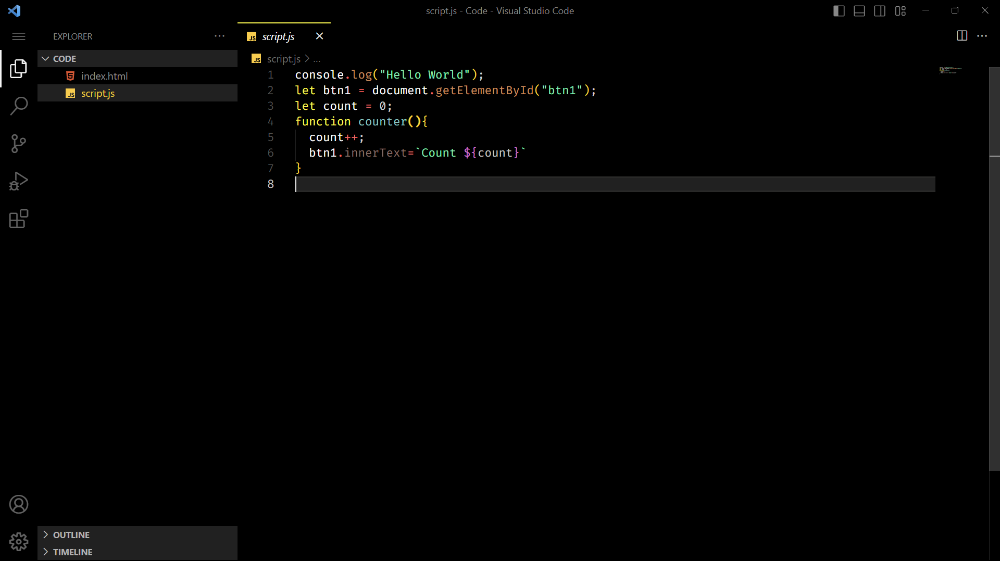
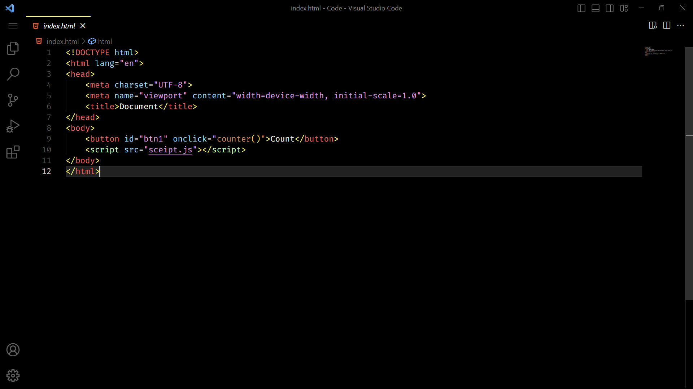

# Live in the Dark

Live in the Dark is a sleek and elegant theme designed with a dark color scheme that emphasizes readability and aesthetics. The main color of this theme is `#000000`, which is a rich black shade that adds depth and sophistication to your user interface.

## Features

- Dark color scheme: The theme's primary color, `#000000`, creates a visually appealing and immersive experience.
- Minimalistic design: Live in the Dark focuses on simplicity and elegance, reducing visual clutter and allowing your content to take center stage.
- Readability: The carefully chosen color palette and contrast ratios ensure that text and other elements are easy to read and navigate.
- Customizable: While the main color is `#000000`, you can easily customize other elements of the theme to suit your preferences.

## Screenshot

---

About Me

My name is Riasat Sk. I am a passionate developer and technology enthusiast. You can find me on GitHub as [@riasatsk](https://github.com/riasatsk).

{: width="512" height="512"}

Feel free to connect with me and explore my projects on GitHub.
